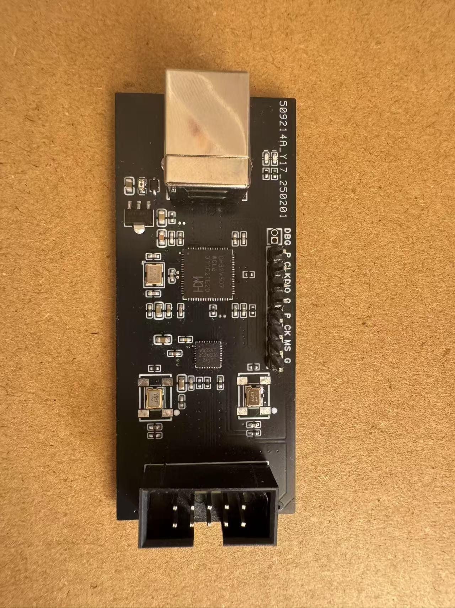
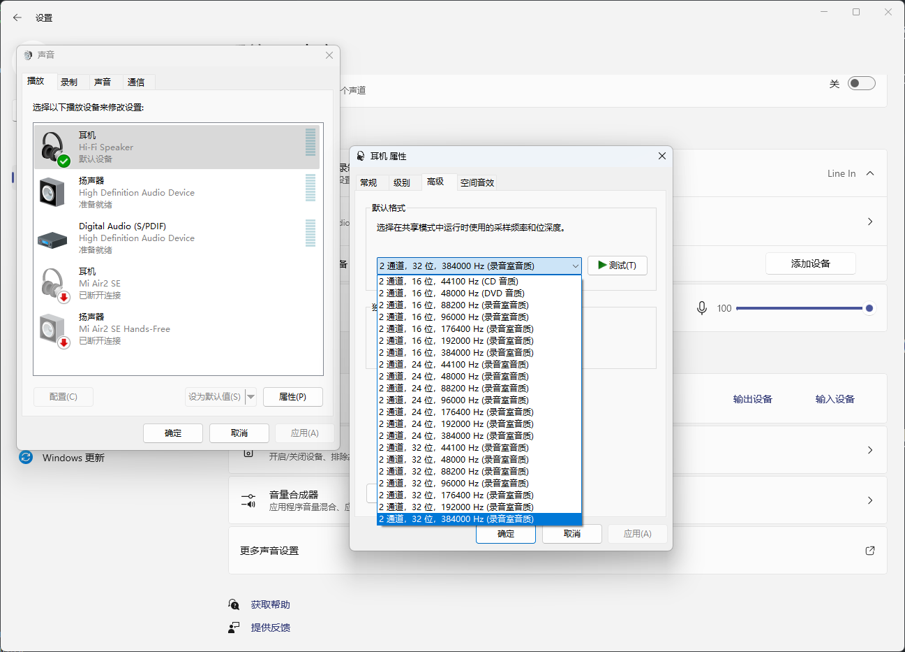

# USBAudioToI2S
Firmware from UAC2.0 to I2S, supporting up to 32-bit 384KHz.

This project is a low-cost implementation of UAC2.0 to I2S, using MCU+CPLD to achieve asynchronous USB audio. This project can replace Amanero and XMOS solutions.

The supported audio formats are as follows:

- `AGRV2KQ32`: CPLD firmware.
- `CH32V307`: MCU firmware.

## How to build

### CH32V307

Visit [WCH](https://www.wch.cn/products/CH32V307.html) for more information.

### AGRV2KQ32

Visit [AGM](http://www.tcx-micro.com/doc_27047096.html) for more information.

Two oscillators are necessary (24.576MHz and 22.5792MHz), in this case, the internal PLL will be used to generate sample frequency.

If you would like to use your external PLL, please use `\nopll` to replace corresponding files. Otherwise, please ignore `\nopll`.

## Schematic

[Schematic](https://oshwhub.com/lovelonelytime/usbtoi2s)
